# RuleML Job Screening System - Core Logic Diagrams

## 1. RuleML Structure & Organization

## 2. RuleML Evaluation Flow (Complete Process)

```mermaid
flowchart TD
    Start([Applicant Submits Form]) --> Parse[Parse RuleML XML<br/>Remove Namespaces]
    Parse --> Extract[Extract Applicant Data<br/>Name, Education, Experience, Skills]
    Extract --> Count[Count Skill Matches<br/>Required: X/5<br/>Optional: Y/5]
    
    Count --> BuildObj[Build Applicant Object<br/>education: value<br/>experience: value<br/>required_skills_match: X<br/>relevant_experience: true/false]
    
    BuildObj --> Priority{Check Rules by Priority<br/>REJECT → ACCEPT → REVIEW}
    
    Priority --> CheckReject[Evaluate REJECTION Rules]
    
    CheckReject --> RejectMatch{Rule<br/>Matched?}
    RejectMatch -->|YES| RejectAction[Execute Action Block]
    RejectAction --> RejectResult[❌ REJECT<br/>+ Reason<br/>+ Rule ID<br/>+ Priority]
    
    RejectMatch -->|NO| CheckAccept[Evaluate ACCEPTANCE Rules]
    
    CheckAccept --> AcceptMatch{Rule<br/>Matched?}
    AcceptMatch -->|YES| AcceptAction[Execute Action Block]
    AcceptAction --> AcceptResult[✅ ACCEPT<br/>+ Reason<br/>+ Rule ID<br/>+ Priority]
    
    AcceptMatch -->|NO| CheckReview[Evaluate REVIEW Rules]
    
    CheckReview --> ReviewMatch{Rule<br/>Matched?}
    ReviewMatch -->|YES| ReviewAction[Execute Action Block]
    ReviewAction --> ReviewResult[👀 REVIEW<br/>+ Reason<br/>+ Rule ID<br/>+ Priority]
    
    ReviewMatch -->|NO| DefaultReview[Default: REVIEW<br/>Manual review required]
    
    RejectResult --> Display[Display Result Page]
    AcceptResult --> Display
    ReviewResult --> Display
    DefaultReview --> Display
    
    Display --> End([End])
    
    style Start fill:#90EE90,color:#000
    style Parse fill:#87CEEB,color:#000
    style Priority fill:#764ba2,color:#fff
    style RejectResult fill:#FFB6C1,color:#000
    style AcceptResult fill:#98FB98,color:#000
    style ReviewResult fill:#FFD700,color:#000
    style DefaultReview fill:#FFD700,color:#000
    style Display fill:#87CEEB,color:#000
    style End fill:#90EE90,color:#000
```

## 3. Rule Condition Evaluation Logic (AND/OR)

---

## How to View These Diagrams

### In VS Code:
1. Install extension: **"Markdown Preview Mermaid Support"**
2. Open this file and press `Ctrl+Shift+V` (Preview)

### Online:
Visit **https://mermaid.live/** and paste diagram code

### In Report:
Take screenshots of rendered diagrams for inclusion in practical report

---

## Diagram Explanations

**Diagram 1 - RuleML Structure:**
Shows the complete XML structure with 3 rule categories (Accept/Reject/Review), job definition, and the anatomy of a single rule element with conditions and actions.

**Diagram 2 - Evaluation Flow:**
Complete step-by-step process from form submission to final decision, showing priority-based evaluation (Reject → Accept → Review) and how each rule category is checked sequentially.

**Diagram 3 - Condition Logic:**
Details how individual rules evaluate conditions using AND/OR logic, the 4 supported operators (eq, gte, lt, in), and how requirement results determine rule matching.

---

**Color Legend:**
- 🟢 Green: Success/Start/End
- 🟡 Yellow: Review/Default paths
- 🔴 Pink: Reject paths  
- � Blue: Process steps
- 🟣 Purple: Decision points
- 🟩 Teal: Accept paths
